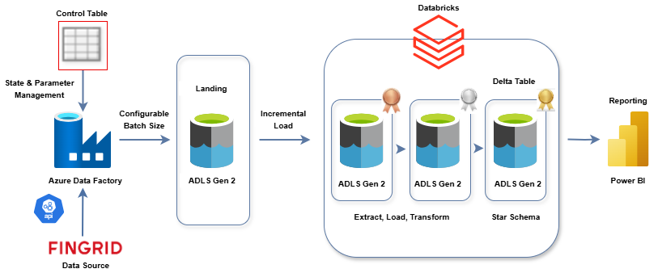
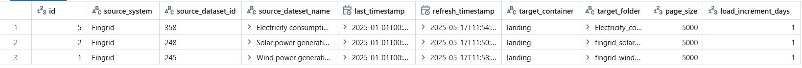

# Data Engineering Fingrid Project

## Overview

I developed a **scalable, metadata-driven data engineering solution** that harvests Finland's national power grid data from [Fingrid's Open Data API](https://data.fingrid.fi/en/) and transforms it into actionable business intelligence.  
The system employs an enterprise-grade architecture to process electricity consumption and power generation forecast data through a configurable ETL pipeline.

The architecture implements industry best practices, including:

- **Incremental loading** with configurable batch sizes
- **State management** through control tables
- A **medallion data lakehouse pattern** that progressively improves data quality from raw ingestion to analytical-ready assets

## Architecture

---

## Technical Solution

This solution showcases modern data engineering best practices through the following components:

### Metadata-Driven ETL

- **Parameterized Azure Data Factory pipelines** controlled through a centralized configuration table
- Enables dynamic processing of new data sources and logic without code changes

### Incremental Data Loading

- Efficient data ingestion with **configurable batch sizes** and **state tracking**
- Optimized for performance and resource utilization

### Medallion Architecture

- Data is structured through **bronze** (raw), **silver** (validated), and **gold** (business-ready) layers in Databricks
- Ensures progressive data quality improvement

### Unity Catalog Integration

- Incorporates **Databricks Unity Catalog** for enterprise-grade data governance and security across the platform

### Delta Lake Implementation

- Utilizes **Delta Lake** as the core storage format throughout the data lakehouse
- Provides ACID transaction guarantees and schema enforcement for data integrity

### End-to-End Integration

- Seamless connection from source systems (Fingrid API) to business intelligence tools (Power BI)
- Appropriate data transformations at each stage for analytics and reporting

---

## Key Features

- **Scalable and modular ETL pipelines**
- **Automated, metadata-driven orchestration**
- **Robust data quality and governance**
- **Actionable insights delivered to business users**

---

## Technologies Used

- Azure Data Factory
- Azure Data Lake Storage Gen2
- Databricks (with Unity Catalog & Delta Lake)
- Power BI
- Pyspark
- Fingrid Open Data API

---

> This repository demonstrates a production-ready, extensible data engineering platform for real-time energy analytics and reporting.
